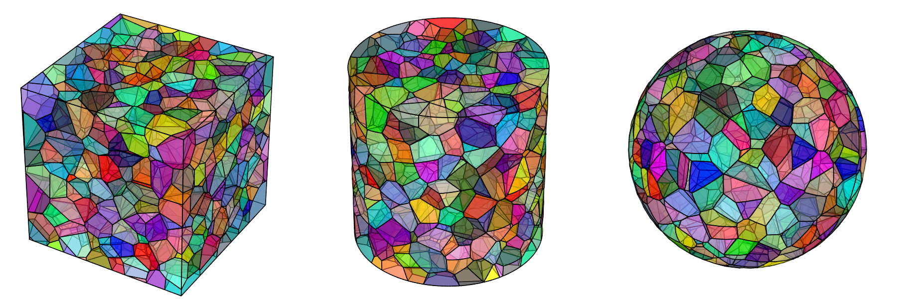
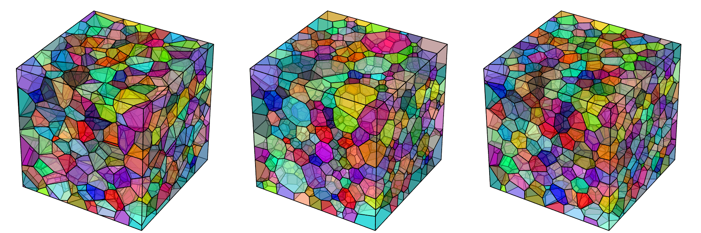
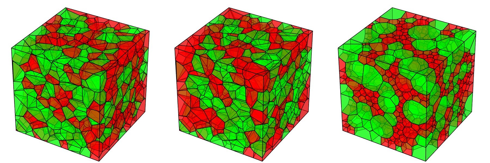
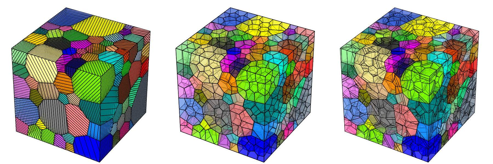
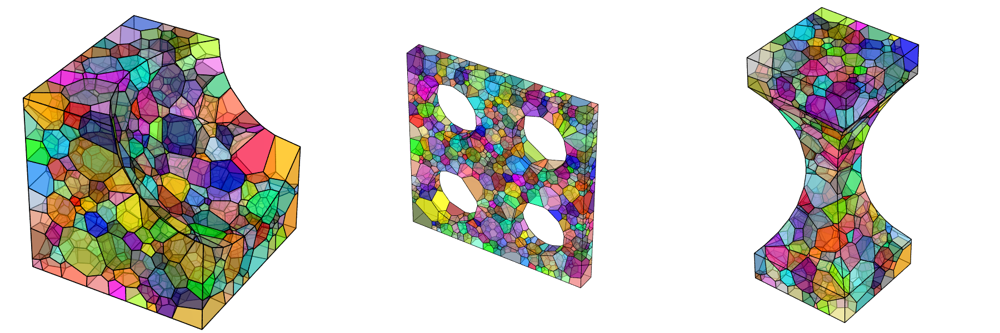
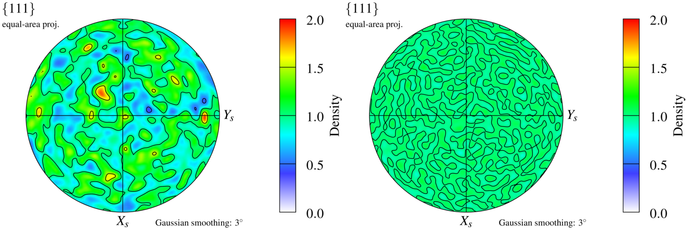
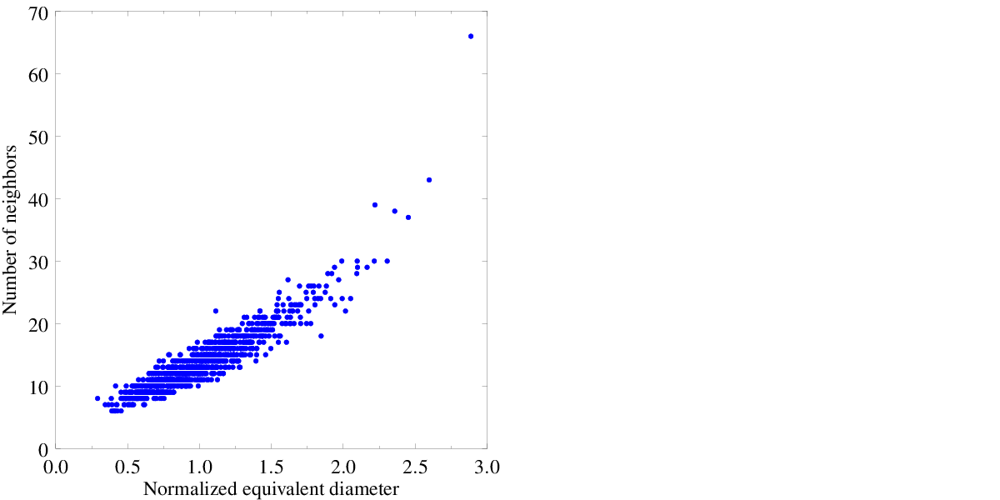

# Generation

Module -T is dedicated to tessellation generation. Its primary capabilities are _(i)_ the generation of tessellations from cell properties (statistical, e.g. a size distribution, or defined grain by grain), _(ii)_ the definition of cell groups (to represent different material phases) and _(iii)_ the generation of multiscale tessellations (i.e. including cell subdivisions). These capabilities can also be used together. Tessellations are composed of convex cells (Laguerre tessellations).  Finally, the tessellations can be _regularized_ to remove their smallest entities (edges and faces), which enables for good-quality meshing with module -M.  Periodicity conditions can be prescribed. Crystal orientations are provided for the grains.  The output is a tessellation file written at a scalar (vectorial) or raster format.

Generalities
------------

Tessellations are built in a finite domain of space. A unit cubic domain is used by default, but cylindrical domains and spherical domains are also available while other, arbitrary convex domains can be defined, as illustrated below.  Tessellations can contain an arbitrary number of cells and can be 2D or 3D.  Crystal orientations are assigned to the cells.  Below is the generation of 1000-cell Voronoi tessellations (the default) in various 3D domains:

```bash
neper -T -n 1000
neper -T -n 1000 -domain "cylinder(1,100)"
neper -T -n 1000 -domain "sphere(1,1000)"
```



[gene_gene.sh](imgs/gene_gene.sh)

## Tessellations from morphological properties

Tessellations can be of different types, depending on how seeds are defined, but are (almost) always composed of convex cells.  By default, a Voronoi tessellation is generated, for which seeds have random positions (following a uniform distribution).  If (experimental) morphological properties are provided for the cells as input, a Laguerre tessellation is generated for which the seed attributes are optimized so as to reproduce these properties. The properties can be statistical distributions (e.g. a cell size distribution) or defined grain by grain (cell centers, etc., including a full polycrystal image).  The method has no particular limitations (except that it generates convex cells) and allows for the generation of a wide variety of microstructure morphologies.

```bash
neper -T -n 1000 -morpho voronoi (or $ neper -T -n 1000)
neper -T -n 1000 -morpho graingrowth
neper -T -n 1000 -morpho "diameq:dirac(1),1-sphericity:lognormal(0.145,0.03)"
```



[gene_morp.sh](imgs/gene_morp.sh)


## Cell groups to represent phases

Cell groups can be defined to represent different phases of a material.  Groups can be defined (post-tessellation) from arbitrary cell properties but are typically associated to the different modes of a multi-modal morphological property (e.g. the cell size distribution).

```bash
neper -T -n 1000 -group "id<=500?1:2" -o gene_grou_1
neper -T -n 1000 -group "vol>=0.001?1:2" -o gene_grou_2
neper -T -n 1000 -morpho "diameq:diameq:0.8*lognormal(1,0.35)+0.2*lognormal(2,0.6),1-sphericity:lognormal(0.230,0.03)" -group mode -o gene_grou_3
```



[gene_grou.sh](imgs/gene_grou.sh)


## Multiscale tessellations

Multiscale tessellations can also be generated, which are obtained by subdividing each cell of an existing tessellation into a new tessellation (possibly several times). All capabilities available for standard, 1-scale tessellations are available for multiscale tessellations. Such tessellations can be used to represent complex microstructures such as those observed in steels, titanium alloys, etc.  Multiscale tessellations can be meshed just as standard tessellations.

```bash
neper -T -n 200::from_morpho            -morpho "gg::lamellar(w=0.02)"
neper -T -n 200::1000*size              -morpho 'gg::diameq:dirac(1),sphericity:lognormal(0.145,0.03,1-x)'
neper -T -n 200::1000*size::from_morpho -morpho 'gg::diameq:dirac(1),sphericity:lognormal(0.145,0.03,1-x)::lamellar(w=0.01:0.03)'
```



[gene_mult.sh](imgs/gene_mult.sh)

## Periodic and semi-periodic tessellations

Full periodicity or semi-periodicity can be prescribed to the domain and therefore to the resulting tessellation.  Periodicity can be used to avoid boundary effects and reduce the size of the representative volume element.  Below are 1000-cell tessellations with full periodicity, 2-direction semi-periodicity and 1-direction semi-periodicity, successively, viewed along the y axis.  These tessellations can be meshed just as standard, non-periodic tessellations.

```bash
neper -T -n 1000 -morpho graingrowth -periodicity all
neper -T -n 1000 -morpho graingrowth -periodicity x,y
neper -T -n 1000 -morpho graingrowth -periodicity x
```


[gene_peri.sh](imgs/gene_peri.sh)


## Non-convex domains

Non-convex domains can be obtained by cutting a tessellation by one or several geometrical primitives, such as half-spaces, spheres, cylinders, elliptic cylinders, etc.  The current implementation is limited to the case where the local curvature of the geometrical primitive is larger than the typical cell size, so, this remains an experimental feature. The resulting tessellations can be regularized and meshed just as standard, convex tessellations.

```bash
neper -T -n 1000 -morpho gg -transform "cut(sphere(1,0.5,1,0.7))"
neper -T -n 1000 -morpho gg -domain "cube(1.2,0.1,1.2)" -transform "cut(cylinder(0.3,0,0.3,0,1,0,0.15),cylinder(0.3,0,0.9,0,1,0,0.15),cylinder(0.9,0,0.3,0,1,0,0.15),cylinder(0.9,0,0.9,0,1,0,0.15))"
neper -T -n 1000 -morpho gg -domain "cube(0.6,0.6,1.4):translate(-0.3,-0.3,-0.7)" -transform "cut(cylinder(-0.9,0,0,0,1,0,0.8),cylinder(0.9,0,0,0,1,0,0.8),cylinder(0,-0.9,0,1,0,0,0.8),cylinder(0,0.9,0,1,0,0,0.8))"
```



[gene_cut.sh](imgs/gene_cut.sh)

## Crystal orientation distribution

Crystal orientations are assigned to the cells.  The first type of crystal orientation distribution is *random*, which corresponds to the standard case for which orientations are distributed randomly according to a uniform distribution.  The second type of crystal orientation distribution is *uniform*, which corresponds to a new case for which orientations are distributed uniformly (still according to a uniform orientation distribution), i.e. there will be no local orientation clusters as is typical from a random distribution.  It is important to specify the crystal symmetry in this case.

```bash
neper -T -n 1000 -format ori
neper -T -n 1000 -oricrysym cubic -ori uniform -format ori
```



_(left) Random distribution, (right) uniform distribution._


## Regularization

Tessellations usually contain a large number of small edges and faces.  While these entities have a negligible effect on the cell morphologies, they are strongly detrimental to meshing because they represent strong constraints (which generates low-quality elements).  Neper includes a _regularization_ method that removes the small edges and faces, as illustrated below. Note that regularization does not change the overall grain morphology while it removes most of the small edges and faces.


_(left) No regularization, (middle) regularization, (right) edge length distributions._

[gene_regu.sh](imgs/gene_regu.sh)

## Scalar and raster formats

Tessellations can be written at scalar and raster formats.  Scalar tessellations can be meshed into tetrahedral elements using -M while raster tessellations can be readily used in fast-Fourier transform (FFT) computations.  for The size of the raster can be specified. Below are shown a scalar tessellation and the corresponding raster tessellation constructed on a raster of 64 x 64 x 64 voxels.

```bash
neper -T -n 1000 -morpho graingrowth -format tess,tesr -tesrsize 64
```


[gene_form.sh](imgs/gene_form.sh)

## Statistics

A wide array of statistics are available on the cells or even on the faces, edges, vertices and seeds. Morphology and topology properties are available. For example, the cell variables include: the centroid coordinates, the volume, the numbers and lists of vertices, edges and faces, the surface areas and equations of the faces, etc. An example of statistical analysis on a 300-cell tessellation is illustrated below.

```bash
neper -T -n 1000 -morpho gg -per 1 -statcell diameq:rel,facenb
```



[gene_stat.sh](imgs/gene_stat.sh)
